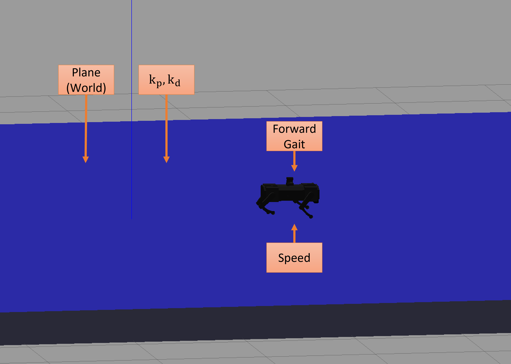
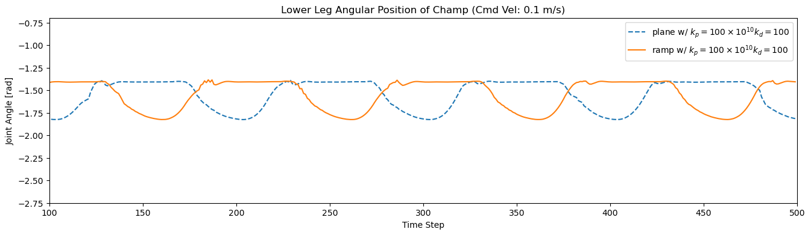
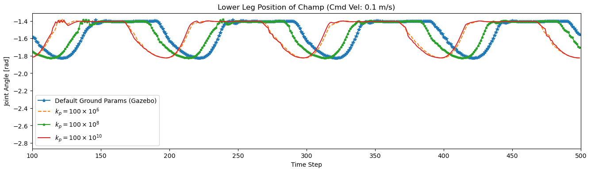
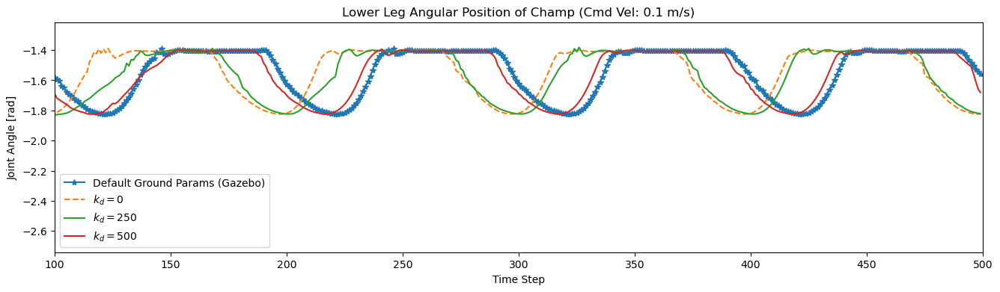
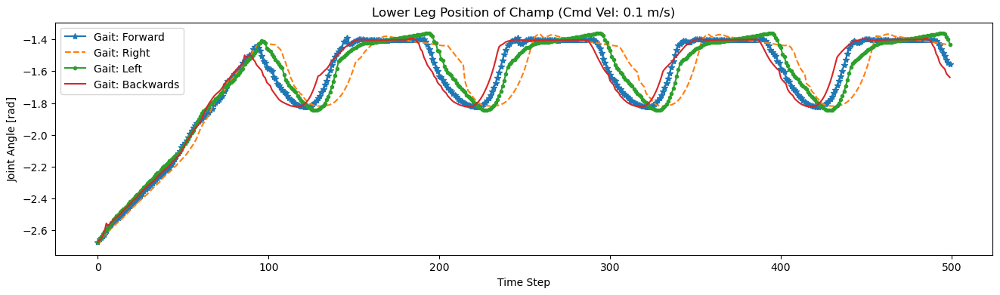
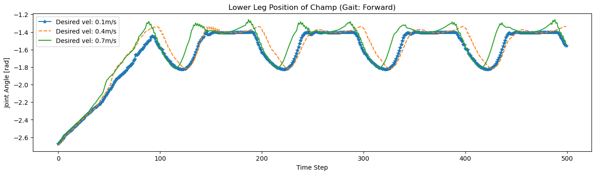
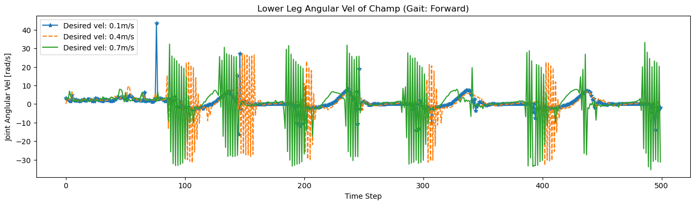

# terrain_champ

## Overview ##
The goal of this repository is to provide a dataset of quadruped locomotion on different terrain profiles/parameters. The dataset consists of joints states and ground reaction forces from champ walking on different ground parameters/terrain simulated on the Gazebo platform. Different gait patterns (forward, left, right, backward), commanded velocities, ground parameters, and terrain profiles are simulated within this dataset.

Dependencies consist of ROS melodic with gazebo-9 on Ubuntu 18.04. To be able to run the shell script to collect data, you must create a catkin workspace. Follow the tutorial of creating a workspace on the ROS website.

**Keywords:** Dataset, Legged Robots, Quadruped, Terrain Parameters

## Installation ##

### Build catkin workspace ###
```
mkdir -p ~/champ_ws/src
cd ~/champ_ws
catkin_make
source ~/champ_ws/devel/setup.bash

### Install Dependencies ###
```
sudo apt install -y python-rosdep
cd ~/champ_ws/src
git clone --recursive https://github.com/AndrewZheng-1011/terrain_champ.git
cd ~/champ_ws/src
rosdep install --from-paths src --ignore-src -r -y
cd ~/champ_ws
catkin_make
source ~/champ_ws/devel/setup.bash
```
```
### Add mesh files to Gazebo model path ###
Add model files into gazebo model path through ~/.bashrc
```
gedit ~/.bashrc
export GAZEBO_MODEL_PATH=~/champ_ws/src/terrain_champ/impact_listener/models:${GAZEBO_MODEL_PATH}
```
If there is already an existing path export to gazebo model path, add to the existing path.
Remark: Note you must modify this command line
```
export GAZEBO_MODEL_PATH=<~/existing/model/path>:~/champ_ws/src/terrain_champ/impact_listener/models
```
## Quick Start ##
### Launch ###
The roslaunch file will run the champ simulator across default terrain (specified in the shell file) for default gait (forward) and commanded velocity (0.5m/s). The corresponding recorded data will be located in the data directory
```
cd ~/<your_catkin_ws>
roslaunch impact_listener start.launch
```
### Shell Script ###
The shell script will run the champ simulator across default terrain (specified in the shell file) for different gaits and commanded velocity. This script simulates different environments/actions and collect quadruped joint states and grf (ground reaction forces) during locomotion. The recorded data will then be located in the data directory.
```
cd ~/<your_ws>
roscd impact_listener/script/
./start_experiment.sh
```
## Data
The dataset obtains the following states from champ
- Joint States (e.g. hip, upper leg, lower leg joints)
- Ground Reaction Forces

Data format for parsing data can be found in the file formatForChampData

The data that can be collected through the shell script ranges by changing these parameters:
- World - Currently support planar world and a ramp world
- Terrain Parameters - Stiffness and damping parameters are defined within the model sdf files (plane/ramp)
- Action - Shell script loops through forward, left, right, and backward gait motion
- Commanded CoM Velocity - Shell script loops through velocities ranging from 0.1m/s to 0.7 m/s

### World ###
Currently supports a 2 deg ramp profile and planar world. A graph represented of quadruped locomotion on different worlds is shown below. 
For quadruped locomotion in different terrains, different initial condition during rest phase is inherent. However, any distinct qualitative observations between the two terrain profiles cannot be concluded


### Terrain Parameters
Stiffness and damping parameteres are defined by the stiffness and damping tags in world files (k<sub>p</sub> and k<sub>d</sub>.
From the graph, increase in damping affect is seen to hinder the quadruped swing and stance duration.



### Action ###
Different gait motion is defined through shell script. Currently, shell script only runs through the actions forward, left, right, and backwards.


### Commanded CoM Velocity ###
Results showcase that increase in commanded velocity of champ increases the swing phase. Stance phase is consistent as champ controller predefines a fixed stance duration.



Quantitative analysis is left to be done in future works.

## Additional Details ##
- To run readSimData.ipynb and get the resulting graphs, must collect the data specified in code

## Notes/Future Works: ##
- Get CoM states
- Apply rosbag to record states
- Make impact_listener/src files robust when no data directory (i.e. try: os.mkdir  (...) except (...))
- Preprocess impact data (i.e. get force profiles from quadruped locomotion)
- Create process to change terrain parameters defined in sdf files in models directory
- Enable different physics engine (e.g. ode, pybullet, etc.)
- Create preprocess script for GRF
- Synchronize data from subscription for easier preprocess
- Create new rosmsg or plugin to record the states altogether
