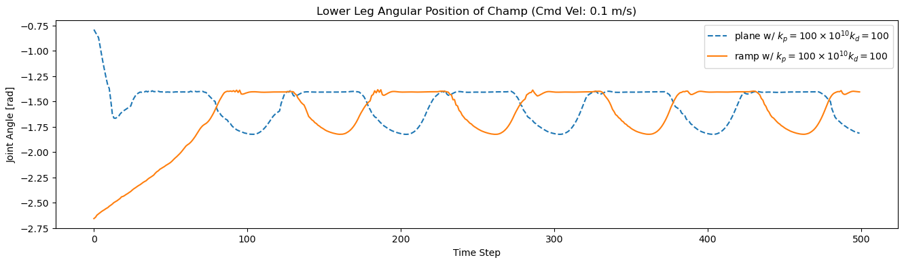

# terrain_champ
The goal of this repository is to provide a dataset of quadruped locomotion on different terrain profiles/paramters. The dataset consists of champ quadruped walking different ground parameters/terrain simulated on the Gazebo platform. Different gait patterns (forward, left, right, backward), commanded velocities, ground parameters, and terrain profiles are simulated within this dataset.

**Keywords:** Dataset, Legged Robots, Quadruped, Terrain Parameters

## Installation (To be tested): ##
### Install Dependencies ###
```
sudo apt install -y python-rosdep
cd <your_ws>/src
git clone --recursive https://github.com/AndrewZheng-1011/terrain_champ.git
git clone https://github.com/chvmp/champ_teleop
cd ..
rosdep install --from-paths src --ignore-src -r -y
```
### Build workspace ###
```
cd <your_ws>
catkin_make
source <your_ws>/devel/setup.bash
```
### Add mesh files to Gazebo model path ###
```
gedit ~/.bashrc
export GAZEBO_MODEL_PATH=~/<workspace_directory>/src/terrain_champ/impact_listener/models:${GAZEBO_MODEL_PATH}
```

## Quick Start ##
Quick start will run the champ simulator across default terrain (specified in the shell file) for different gaits and commanded velocity
```
roscd impact_listener/script/
./start_experiment.sh
```
## Data
The data that can be collected through the shell script ranges by changing these parameters:
- World - Currently support planar world and a ramp world
- Terrain Parameters - Stiffness and damping parameters are defined within the model sdf files (plane/ramp)
- Action - Shell script loops through forward, left, right, and backward gait motion
- Commanded velocity - Shell script loops through velocities ranging from 0.1m/s to 0.7 m/s

### World ###
Currently supports a 2 deg ramp profile and planar world. A graph represented of quadruped locomotion on different worlds is shown below. 
For quadruped locomotion in different terrains, different initial condition during rest phase is inherent. However, any distinct qualitative observations between the two terrain profiles cannot be concluded


### Terrain Parameters
Stiffness and damping parameteres are defined by the stiffness and damping tags in sdf models (k<sub>p</sub> and k<sub>d</sub>.
From the graph, increase in damping affect is seen to hinder the quadruped swing and stance duration.


### Action ###
Different gait motion is defined through shell script. Currently, shell script only runs through the actions forward, left, right, and backwards.


### Commanded Velocity ###
Results showcase that increase in commanded velocity of champ increases the swing phase. Stance phase is consistent as champ controller is predefines a fixed stance duration.


Quantitative analysis is left to be done in future works.

## Additional Details ##
- To run readSimData.ipynb and get the resulting graphs, must collect the data specified in code

## Notes/Future Works: ##
- Apply rosbag to record states
- Work on making plots on the trajectory difference of different terrains
- Make impact_listener/src files robust when no data directory (i.e. try: os.mkdir  (...) except (...))
- Preprocess impact data (i.e. get force profiles from quadruped locomotion)
